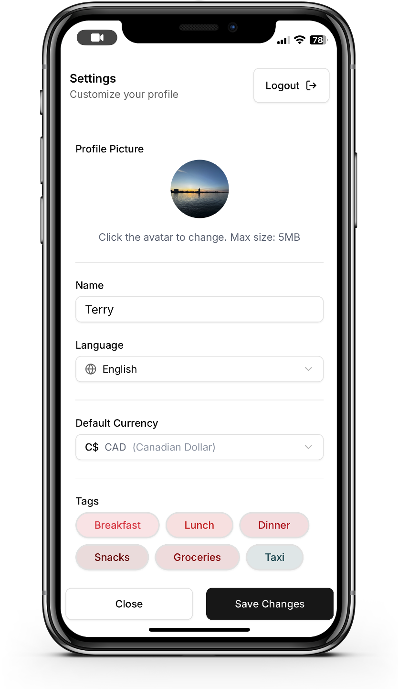

# Smart Ledger 👋
Smart Ledger is a **self-hosted, LLM-powered, multi-input personal expense tracking system**  designed for privacy-conscious users who want intelligent automation without sacrificing data ownership.

## Key Features
- 🛡️ **Self-hosted** 
Deploy Smart Ledger on your own server or machine. Your financial data remains **fully under your control**  — no third-party storage, no data tracking. Seamlessly **sync across devices**  to keep your records accessible and consistent.

- 🎙️ **Voice Input** 
Record spoken expense entries. Powered by **Whisper**  for speech recognition and integrated with an **LLM**  for context understanding, Smart Ledger can convert your voice into clean, structured financial transactions with ease.

- 📷 **Picture Input** 
Snap photos of receipts or bills. Smart Ledger uses **multi-LLM models** to automatically extract key financial details like amount, date, and category — no manual typing required.

- 💻 **Beautiful User Interface** 
Enjoy a modern, mobile-friendly UI built with **Next.js**. Designed for simplicity and speed.




- 🏷️ **Tagging & Categorization** 
Add your own custom tags or let the AI suggest and infer tags based on transaction content. Smart Ledger helps keep your records organized effortlessly.

- 🔒 **Full Privacy & Control** 
All components are **open-source and self-manageable** . No vendor lock-in, no hidden data sharing — just transparent software that puts you in charge.


## How to Install 🚀

## 主要功能

### 已完成功能
- [x] 用户认证系统
  - 用户注册
  - 用户登录
  - 用户注销
  - 管理员账户管理
- [x] 基础 UI 组件
  - 响应式布局
  - 导航菜单
  - 用户界面组件
- [x] 数据库集成
  - MongoDB 连接
  - 用户数据模型
  - 数据持久化
- [x] 基础设置界面
  - [x] 用户头像设置
  - [x] 语言选择
  - [x] 货币设置
  - [x] 标签管理
    - [x] 添加标签
    - [x] 编辑标签
    - [x] 删除标签
    - [x] 标签颜色选择
  - [x] 地点管理
    - [x] 添加地点
    - [x] 编辑地点
    - [x] 删除地点
- [x] 交易记录功能
  - [x] 图片识别交易
    - [x] 图片上传
    - [x] 图片预览
    - [x] 交易信息识别
    - [x] 交易确认界面
  - [x] 语音识别交易
    - [x] 语音录制
    - [x] 音量可视化
    - [x] 交易信息识别
    - [x] 交易确认界面
  - [x] 交易列表展示
    - [x] 按月份分组
    - [x] 交易详情展示
    - [x] 交易编辑功能
    - [x] 交易删除功能

### 进行中功能
- [ ] 数据统计与分析
  - [ ] 支出分类统计
  - [ ] 收入分类统计
  - [ ] 时间趋势分析
  - [ ] 预算管理
- [ ] 多语言支持
  - [ ] 中文界面
  - [ ] 英文界面
  - [ ] 语言切换功能

### 计划功能
- [ ] 数据导出功能
  - [ ] Excel导出
  - [ ] PDF报表
  - [ ] 数据备份
- [ ] 智能提醒
  - [ ] 定期账单提醒
  - [ ] 预算超支提醒
  - [ ] 异常消费提醒
- [ ] 社交功能
  - [ ] 家庭共享账本
  - [ ] 消费建议分享
  - [ ] 理财经验交流

## 技术栈

### 前端
- **框架**: Next.js 15.3.1
- **UI 库**: 
  - Radix UI
  - Tailwind CSS
  - Framer Motion
- **状态管理**: React Hooks
- **类型检查**: TypeScript

### 后端
- **API**: Next.js API Routes
- **数据库**: MongoDB
- **认证**: JWT (JSON Web Tokens)
- **AI 集成**: 
  - Google Gemini AI（智能分析）
  - 语音识别服务
  - OCR 服务

### 开发工具
- **包管理**: npm
- **代码规范**: ESLint
- **版本控制**: Git

## 环境变量

在项目根目录下创建 `.env` 文件，并添加以下环境变量：

```env
# 数据库配置
MONGODB_URI=your_mongodb_connection_string

# 认证配置
JWT_SECRET=your_jwt_secret
JWT_EXPIRES_IN=7d
ADMIN_KEY=your_secure_admin_key

# AI 配置
GOOGLE_AI_API_KEY=your_google_ai_api_key

# 语音服务配置
SPEECH_TO_TEXT_API_KEY=your_speech_to_text_api_key

# OCR 服务配置
OCR_API_KEY=your_ocr_api_key

# 其他配置
NEXT_PUBLIC_APP_URL=http://localhost:3000
```

## 开发指南

### 本地开发

1. 克隆项目：
   ```bash
   git clone <repository-url>
   cd ai-finance
   ```

2. 安装依赖：
   ```bash
   npm install
   ```

3. 配置环境变量：
   ```bash
   cp .env.example .env
   # 编辑 .env 文件，填入必要的配置
   ```

4. 启动开发服务器：
   ```bash
   npm run dev
   ```

5. 访问开发环境：
   ```
   http://localhost:3000
   ```

### 构建和部署

1. 构建项目：
   ```bash
   npm run build
   ```

2. 启动生产服务器：
   ```bash
   npm start
   ```

### 测试

运行测试：
```bash
npm test
```

## 使用示例

### 语音记账
1. 点击语音输入按钮
2. 说出消费内容，例如："今天在星巴克买了一杯拿铁，花了35元"
3. AI 自动识别并生成账单：
   - 类别：餐饮
   - 金额：35元
   - 描述：星巴克拿铁
   - 时间：自动记录

### 图片记账
1. 上传消费小票或发票图片
2. AI 自动识别图片内容
3. 生成标准账单信息

## 贡献指南

1. Fork 项目
2. 创建特性分支 (`git checkout -b feature/AmazingFeature`)
3. 提交更改 (`git commit -m 'Add some AmazingFeature'`)
4. 推送到分支 (`git push origin feature/AmazingFeature`)
5. 创建 Pull Request

## 项目维护

### 代码规范
- 使用 TypeScript 进行开发
- 遵循 ESLint 规则
- 使用 Prettier 进行代码格式化

### 提交规范
- feat: 新功能
- fix: 修复问题
- docs: 文档修改
- style: 代码格式修改
- refactor: 代码重构
- test: 测试用例修改
- chore: 其他修改

## 许可证

MIT License

## 联系方式

如有问题或建议，请通过以下方式联系：
- 提交 Issue
- 发送邮件至 [项目维护者邮箱]
