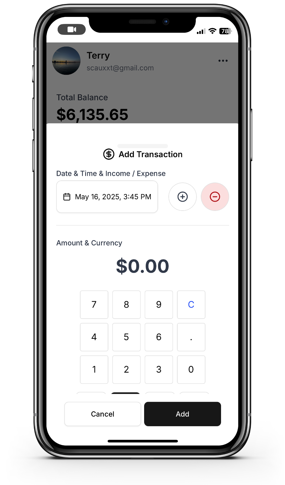

# Smart Ledger 👋
Smart Ledger is a **self-hosted, LLM-powered, multi-input personal expense tracking system** designed for privacy-conscious users who want intelligent automation without sacrificing data ownership.

<div style="display: flex; gap: 12px; flex-wrap: wrap;">
  
  
  
</div>
<div style="display: flex; gap: 12px; flex-wrap: wrap;">
  
  
  
</div>

## ⭐ Key Features 
- 🛡️ **Self-hosted** 
Deploy Smart Ledger on your own server or machine. Your financial data remains **fully under your control**  — no third-party storage, no data tracking. Seamlessly **sync across devices**  to keep your records accessible and consistent.

- 🎙️ **Voice Input** 
Record spoken expense entries. Powered by **Whisper**  for speech recognition and integrated with an **LLM**  for context understanding, Smart Ledger can convert your voice into clean, structured financial transactions with ease.

- 📷 **Picture Input** 
Snap photos of receipts or bills. Smart Ledger uses **multi-LLM models** to automatically extract key financial details like amount, date, and category — no manual typing required.

- 💻 **Beautiful User Interface** 
Enjoy a modern, mobile-friendly UI built with **Next.js**. Designed for simplicity and speed. Can be added to your home screen and run in **fullscreen like a native app**  on iOS/macOS — no need to go through the App Store. Just open in Safari and "Add to Home Screen."


- 💱 **Multi-Currency Support** 
Automatically detects and converts multiple currencies from input (voice, image, or text) — perfect for international usage or travel expense tracking.
 

- 🏷️ **Tagging & Categorization** 
Add your own custom tags or let the AI suggest and infer tags based on transaction content. Smart Ledger helps keep your records organized effortlessly.

- 🔒 **Full Privacy & Control** 
All components are **open-source and self-manageable** . No vendor lock-in, no hidden data sharing — just transparent software that puts you in charge.


## 🚀 Quickstart 

### 🗣️ Install Whisper Transcription Server (Required)
Smart Ledger uses a separate FastAPI-based Whisper server (powered by faster-whisper) to handle speech-to-text transcription.

**Requirements**

- Python 3.8+
 
- `ffmpeg` installed (for `pydub` to work)
 
- A machine with CPU or CUDA-compatible GPU

**Install dependencies**

Go to `/whisper`
```bash
pip install -r requirements.txt
```
**Prepare environment variables**

Create a `.env` file in the root of the whisper server directory.


```bash
cp .env.example .env
```

**Run the server**


```bash
python whisper_server.py
```

Or with `uvicorn`:


```bash
uvicorn whisper_server:app --host 0.0.0.0 --port 8000
```

For testing purposes, I am providing my Whisper server here. Please do not abuse it. **It's unstable and could be shutdown anytime.**

URL: https://whisper.12080123.site/transcribe_sync
API_KEY: 52Wj4mAPw4M6xTW4s6mI


---
### ☁️ Run in Vercel
1. Import the GitHub repo into Vercel
2. Configure Environment Variables 
In the Vercel dashboard, go to your project's Settings > Environment Variables and add the following (based on .env.example)

| Key                     | Description                                             |
| ----------------------- | ------------------------------------------------------- |
| `MONGODB_URI`           | Your MongoDB connection string.                         |
| `MONGODB_DB`            | The database name                                       |
| `NEXTAUTH_URL`          | Your Vercel domain (e.g. `https://your-app.vercel.app`) |
| `NEXTAUTH_SECRET`       | A random secret string                                  |
| `GEMINI_API_KEY`        | Your Gemini API key                                     |
| `GEMINI_MODEL`          | e.g. `gemini-2.0-flash`                                 |
| `INVITE_CODE`           | Optional invite code, used for register                 |
| `TRANSCRIPTION_URL`     | Your Whisper server URL                                 |
| `TRANSCRIPTION_API_KEY` | Your Whisper service                                    |
| `EXCHANGE_RATE_API_KEY` | Currency exchange API key                               |

> You can get a free 128MB database from the MongoDB website.

3. Click "Deploy"
Vercel will build and deploy your app automatically. It may take 1–2 minutes.

4. Done!
You’ll get a live URL like https://smartledger-yourname.vercel.app.

---

### 💻 Run In Your sever 
1. **Clone the repository** 


```bash
git clone https://github.com/bestxxt/SmartLedger.git
cd smart-ledger
```
 
2. **Install dependencies** 


```bash
npm install
```
 
3. **Set up environment variables** 
Copy `.env.example` and rename it:


```bash
cp .env.example .env.local
```


Then fill in the required values like **MongoDB URI, API keys, etc**.
 
4. **Run the app in development** 


```bash
npm run dev
```

### **(Optional) Run in background using PM2** 
[PM2]()  is a production-grade process manager for Node.js applications. It keeps your app running in the background, automatically restarts it on crash or reboot, and makes it easy to manage logs and processes.

**Install PM2 globally**


```bash
npm install -g pm2
```


**Build the Next.js app (if not already done)**

If you're deploying the production build:

```bash
npm run build
```

**Start the app with PM2**

```bash
pm2 start "npm run start" --name smart-ledger
```

 
- `npm run start` starts your Next.js app in production mode.
 
- `--name smart-ledger` assigns a name to your process for easy management.


**Save the PM2 process list**


This ensures your app will restart automatically on system reboot.


```bash
pm2 save
```


**🔁 (Optional) Set up PM2 to start on boot**


```bash
pm2 startup
```

Follow the printed instructions (it will give you a command to run, e.g. `sudo env PATH=... pm2 startup systemd -u youruser --hp /home/youruser`).

**Monitor or manage the process**

```bash
pm2 list              # View all running apps
pm2 logs smart-ledger # View logs for your app
pm2 restart smart-ledger # Restart the app
pm2 stop smart-ledger    # Stop the app
```

## 🎬 Demo Videos 


### 🎙️ Voice Input Demo (Multiple Expenses + Income) 

This video demonstrates Smart Ledger's ability to process natural voice input and generate multiple transactions — including both **expenses**  and **income**  — in a single sentence.

> I said: I had lunch with colleagues at a Korean restaurant, spent 28 dollars.
> On my way home I stopped to get gas, paid 40 dollars.
> Also, I received my salary today — 8000 dollars just landed in my account.”


### 📷 Receipt Image Input Demo 

This video shows how Smart Ledger extracts transaction details from a receipt image using **Multi LLM Model**  and generates a structured expense record.


## 🚧 Development Progress 

> Current Version: `v0.1.0` (Alpha)

### ✅ Core
- [x] User login
- [x] User logout
- [x] User authentication and multi-device sync
- [x] Admin account management
- [x] User registration
- [ ] iPhone shortcut support
- [ ] Google login
- [ ] WeChat login
- [ ] Multi-user account support
- [ ] Offline mode (local caching)
- [ ] Export to Excel / CSV
- [ ] Calendar and reminder integration
- [ ] Forgot password

### 🎨 User Interface 
- [x] Homepage with expense list
- [x] Voice / Camera / Text input modes
- [x] Transaction edit & delete cards
- [x] Settings page (language, currency, tag management...)
- [x] Spending trend visualization
- [x] Installable fullscreen Web App (PWA-style experience)
- [ ] Transaction search and filters (in progress)
- [ ] Statistic page
- [ ] Export page


### 🧠 AI Features
- [x] Voice input via Whisper
- [x] Receipt image recognition (LLM-based parsing)
- [x] Auto-categorization and tag suggestions via LLM
- [x] Multi-currency detection and handling

### 📦 Deploy
- [x] Vercel support
- [ ] Docker support


## 📄 License 

Smart Ledger is open-source and released under the [MIT License](https://mit-license.org/).


